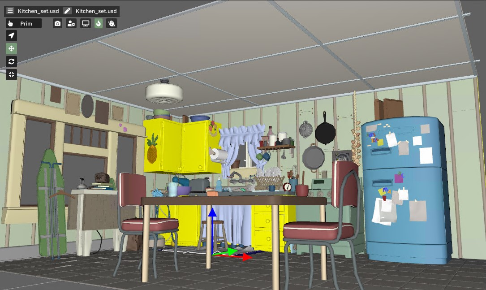
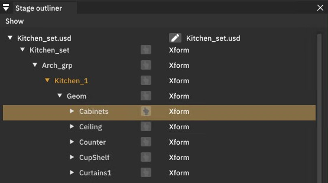
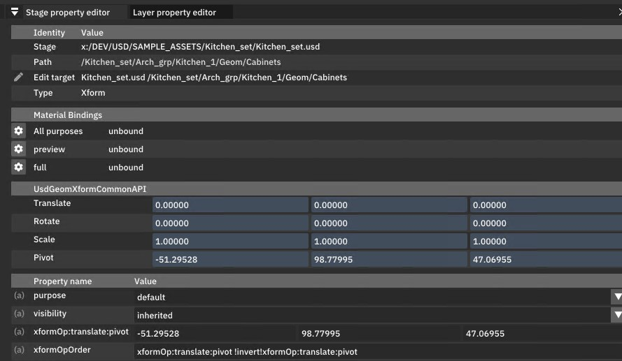

# Layer vs Stage

To effectively use usdtweak, it's important to understand the difference between operating on a layer level and on a stage level.

A [layer](https://openusd.org/release/glossary.html#usdglossary-layer) is essentially a file containing data ([prims](https://openusd.org/release/glossary.html#usdglossary-prim)) and links ([composition arcs](https://openusd.org/release/glossary.html#usdglossary-compositionarcs)) to other files (layers) such as [sublayers](https://openusd.org/release/glossary.html#usdglossary-sublayers), [references](https://openusd.org/release/glossary.html#usdglossary-references), and [payloads](https://openusd.org/release/glossary.html#usdglossary-payload), or even links to other prims. A [stage](https://openusd.org/release/glossary.html#usdglossary-stage) represents a composed scene in memory, resolving various files (layers) and their data (prims) into a final structure based on the USD [composition system](https://openusd.org/release/glossary.html#composition), adhering to their [strength ordering](https://openusd.org/release/glossary.html#livrps-strength-ordering).

In usdtweak, these concepts are implemented as follows:

## Layer

Opening a file as a layer will not display anything in the viewport. However, you can directly access the data in the "Layer Hierarchy" window.

Similar to a text editor, [composition arcs](https://openusd.org/release/glossary.html#usdglossary-compositionarcs) appear as links. You can edit any prim in your layer using the "Layer Property Editor" window.

## Stage

When opened as a stage, the first thing you'll notice is that your objects will appear in the viewport (if present).

Objects/prims can be selected in the viewport or through the "Stage Outliner" window.

Selected prims can be edited in the "Stage Property Editor" window.

