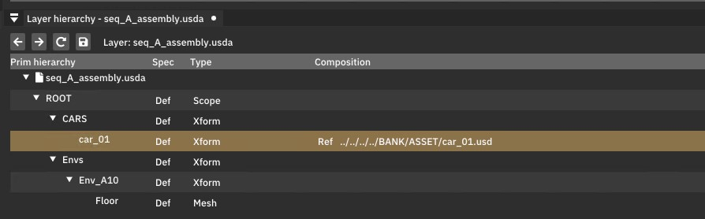
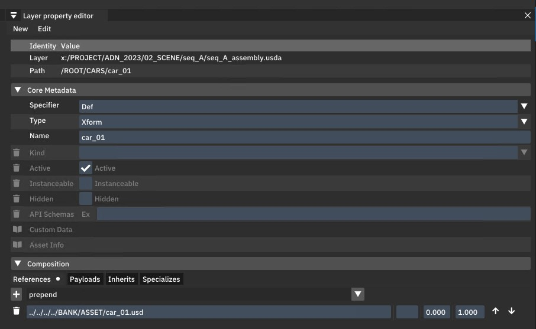
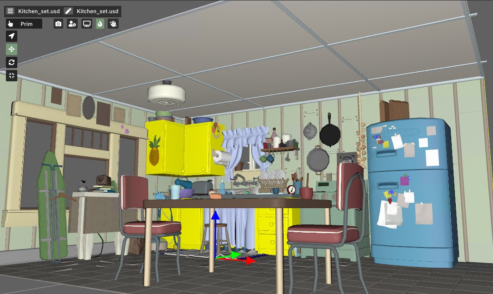
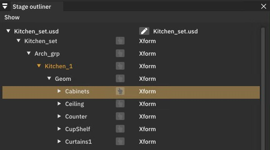
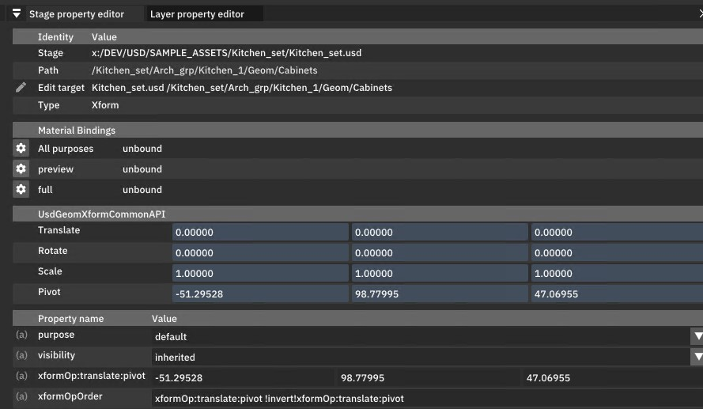

# Layer vs. Stage

To effectively use usdtweak, it is important to understand the difference between operating at the layer level and at the stage level. This distinction is central to how USD works, and usdtweak's interface reflects it directly.

## What is a layer?

A [layer](https://openusd.org/release/glossary.html#usdglossary-layer) is essentially a file containing data ([prims](https://openusd.org/release/glossary.html#usdglossary-prim)) and links ([composition arcs](https://openusd.org/release/glossary.html#usdglossary-compositionarcs)) to other files (layers) such as [sublayers](https://openusd.org/release/glossary.html#usdglossary-sublayers), [references](https://openusd.org/release/glossary.html#usdglossary-references), and [payloads](https://openusd.org/release/glossary.html#usdglossary-payload), or even links to other prims.

Think of a layer as a single source file in a programming project -- it contains authored data, but the full picture only emerges when all files are combined.

## What is a stage?

A [stage](https://openusd.org/release/glossary.html#usdglossary-stage) represents a composed scene in memory. It resolves various files (layers) and their data (prims) into a final structure based on the USD [composition system](https://openusd.org/release/glossary.html#composition), following the [LIVRPS strength ordering](https://openusd.org/release/glossary.html#livrps-strength-ordering).

Think of a stage as the compiled output -- it combines all layers, resolves all references and overrides, and presents the final result.

## Layers in usdtweak

Opening a file as a layer will not display anything in the viewport. However, you can directly access the data in the **Layer Hierarchy** window.

Similar to a text editor, [composition arcs](https://openusd.org/release/glossary.html#usdglossary-compositionarcs) appear as links. You can edit any prim in your layer using the **Layer Property Editor** window.

**Layer-level panels:**
- **Layer Hierarchy** -- Shows prim specs exactly as they are authored in the file.
- **Layer Property Editor** -- Edit properties at the Sdf level, seeing only what exists in this specific layer.
- **Layer Text Editor** -- View the layer in USDA ASCII format.

## Stages in usdtweak

When opened as a stage, the first thing you will notice is that your objects appear in the viewport (if present).

Objects/prims can be selected in the viewport or through the **Stage Outliner** window.

Selected prims can be edited in the **Stage Property Editor** window.

**Stage-level panels:**
- **Stage Outliner** -- Shows the fully composed prim hierarchy.
- **Stage Property Editor** -- Edit composed properties, with changes written to the current edit target layer.
- **Viewport** -- Renders the composed scene with Hydra.

## When to use each

| Scenario | Recommendation |
|----------|----------------|
| Visualizing your scene in 3D | Open as **stage** |
| Editing properties on composed prims | Open as **stage** |
| Debugging composition or reference issues | Open as **layer** |
| Inspecting what is authored in a specific file | Open as **layer** |
| The stage crashes the renderer | Open as **layer** to fix the issue |
| Editing sublayer structure | Both (use Stage Layer Editor with a stage) |

## The connection between them

When you open a file as a stage, usdtweak gives you access to both levels simultaneously. The stage-level panels show composed data, while the layer-level panels show the raw data in the current layer. This lets you see both perspectives at once.

The **edit target** (indicated by the pen icon in the menu bar) controls which layer receives edits you make through the stage-level panels. See [Edit Target](./edit-target) for more details.
