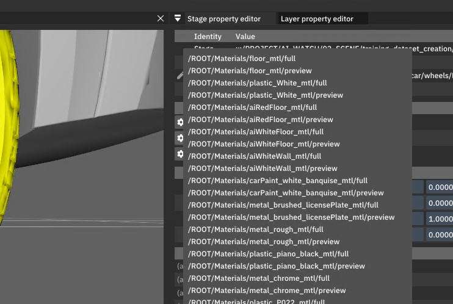

# Assign a Material to a Prim

The easiest way to assign a material to a prim is to use the Stage property editor. For the selected prim that allows material assignment, you should see a "Material binding" section displaying the different bindings per purpose.

Clicking on the cog icon will display a list of all materials available in the stage. Selecting one will assign it to the selected prim for the chosen purpose.

