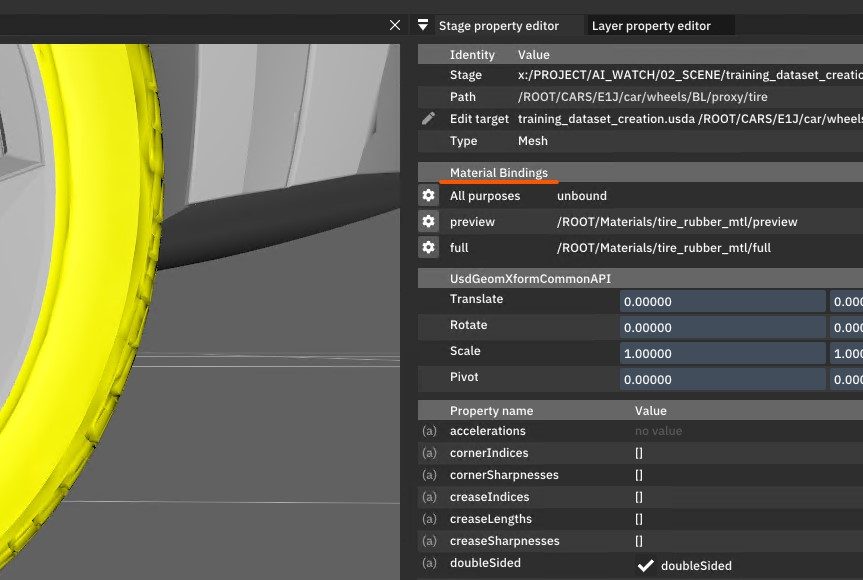
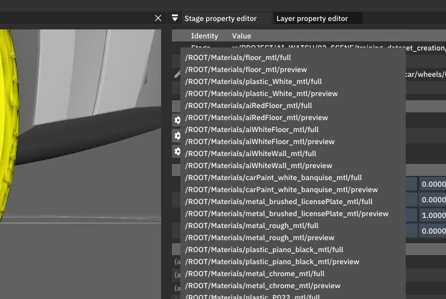

# Materials

usdtweak supports assigning USD materials to prims through the Stage Property Editor. This page covers how to bind materials and manage material assignments.

## Assigning a material

The easiest way to assign a material to a prim is through the **Stage Property Editor**. When you select a prim that supports material binding, you will see a **Material binding** section displaying the current bindings per purpose.

### Selecting a material

Click the **cog icon** next to a binding purpose to display a list of all materials available in the current stage. Select a material from the list to assign it to the prim for that purpose.

## Binding purposes

USD supports multiple material binding purposes. usdtweak displays these in the Material binding section:

| Purpose | Description |
|---------|-------------|
| **Full** | The primary material binding used for final rendering. |
| **Preview** | A simpler material intended for interactive preview rendering. |

You can assign different materials for different purposes, allowing your assets to have both a lightweight preview material and a full-quality render material.

## How material binding works

Material binding in USD uses the `UsdShadeMaterialBindingAPI`. When you assign a material through the Stage Property Editor:

1. A material binding relationship is authored on the selected prim.
2. The binding targets the selected material prim's path.
3. The binding is authored on the current **edit target** layer.

:::info Edit target
Material bindings are written to the current edit target layer. If you want the binding in a specific layer, set the edit target before assigning the material. See [Edit Target](../Concepts/edit-target) for details.
:::

## Removing a material binding

To remove a material binding, you can clear the binding path in the Material binding section of the Stage Property Editor, or remove the binding relationship through the Layer Property Editor.
