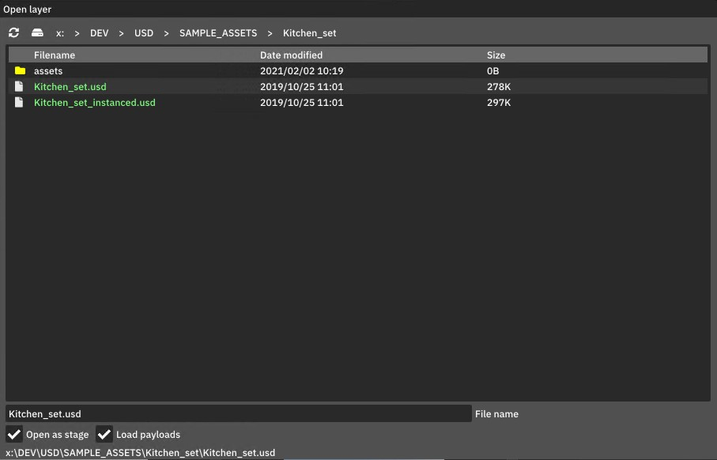

# Open a USD file

To open a USD file with usdtweak, navigate to the file browser under `File > Open`:

This allows you to open the file either as a layer or as a stage, with the option to load the payload when opening the stage. Opening as a layer can be useful in situations where the renderer or Hydra crashes with the stage, as it lets you open the USD file without composing the stage, allowing you to fix the problem.

Alternatively, you can drag and drop a USD file from the system's file browser into usdtweak, and it will open as a layer.

Learn more about the difference between opening a file as a layer or a stage in [Layer vs Stage](../Concepts/LayerVsStage).
