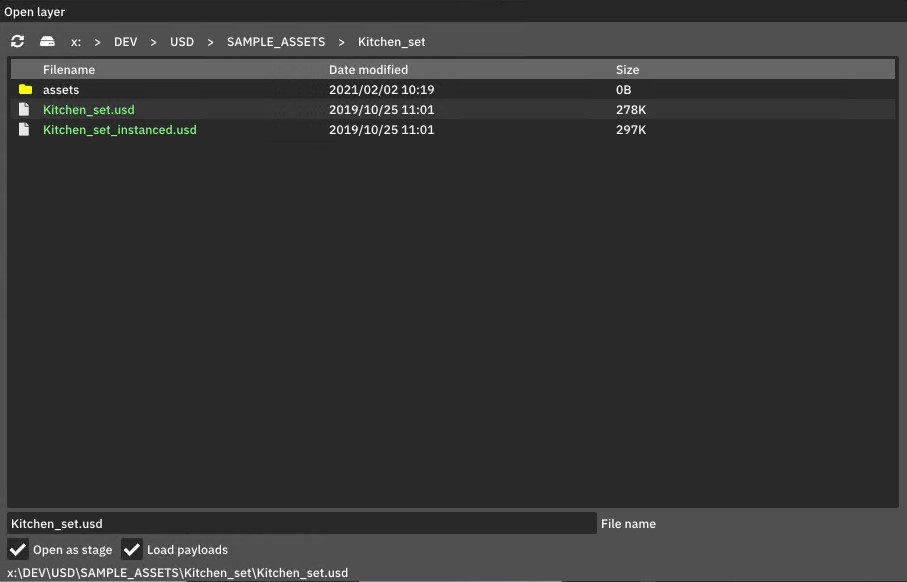

# Opening Files

usdtweak provides several ways to open USD files, with control over how the file is loaded.

## File > Open

Navigate to **File > Open** to launch the file browser dialog.



The dialog provides the following options:

- **Open as stage** -- When checked, the file is opened as a composed stage with all sublayers, references, and payloads resolved. The 3D viewport becomes available. When unchecked, the file opens as a raw layer.
- **Load payloads** -- When opening as a stage, this controls whether payloads are loaded immediately. Unchecking this can speed up opening large scenes where you only need part of the data.
- **Enable viewport rendering** -- When opening as a stage, this controls whether Hydra rendering is activated. Disabling it can be useful for very heavy scenes where you only need the outliner and property editors.

## Open as layer vs. open as stage

The choice between opening as a layer or as a stage is fundamental to how you interact with the file:

- **As a stage** -- The file and all its composed dependencies are resolved into a single scene. You see the final result in the viewport and the Stage Outliner. Edits go to the current edit target layer.
- **As a layer** -- Only the data in that single file is shown, without resolving any composition arcs. Useful when the composed stage causes renderer issues, or when you need to inspect/edit the raw authored data.

Learn more in [Layer vs. Stage](../Concepts/LayerVsStage).

:::tip Recovery workflow
If a stage fails to open because of a bad reference or a Hydra crash, try opening the root layer file **as a layer** instead. This bypasses composition and rendering, letting you fix the problem in the Layer Hierarchy and Layer Property Editor.
:::

## Drag and drop

Drag a USD file from your operating system's file browser and drop it into the usdtweak window. The file will be opened **as a layer** by default. This is a quick way to open files without navigating the file browser dialog.

## Open recent

**File > Open Recent (as stage)** lists recently opened files. Click any entry to reopen it as a stage.

## Command line

You can open files directly when launching usdtweak:

```bash
usdtweak path/to/file.usd
```

Multiple files can be passed as arguments to open several files at once.

## Switching between open files

Once you have multiple files open, use the **Content Browser** panel to switch between them. The Content Browser lists all open stages and layers. Click an entry to make it the active document.

You can also use the **stage selector** button in the menu bar (to the right of the Help menu) to switch between open stages.
